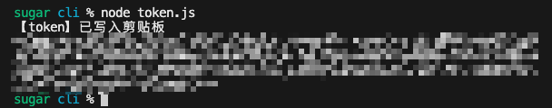
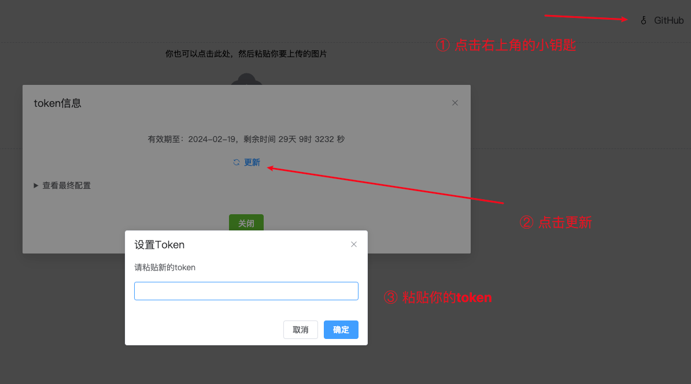

<h1 align="center"> 七牛云OSS图床 </h1>

<p align="center"></p>

<p align="center">基于<a target="_blank" href="https://www.qiniu.com/products/kodo">七牛云对象存储服务</a>搭建的图床应用，<strong>前端纯静态，无需后端</strong></p>

<p align="center">
<a href="" target="_blank">🚧 GitHub Pages Demo</a> |
<a href="https://imgbed.sugarat.top/" target="_blank">Online Demo</a>
</p>

<p align="center">配置你的 token 即可使用</p>

## 使用
### 运行项目
```sh
# 安装依赖
pnpm install

# 开发预览
pnpm dev

# 构建预览
pnpm build

pnpm preview
```

### 🚧 Docker启动

## 配置token
### 生成token
访问 [cli](./../cli/) 目录，修改 `.env` 中的变量
```sh
# 七牛云的 ACCESS_KEY 和 SECRET_KEY
QINIU_ACCESS_KEY=AccessKey
QINIU_SECRET_KEY=SecretKey
# OSS 桶名
QINIU_BUCKET=Bucket

# 绑定的域名，配置时需要带协议,例如 https://abc.example.com
QINIU_DOMAIN=domain
# 资源统一前缀
QINIU_PREFIX=image
# 图片的scope
QINIU_SCOPE=default

# token有效期，默认一个月，单位秒，你可以自行设置
# QINIU_EXPIRES=2592000
```
最后资源地址为 **`domain/prefix/scope/md5`**

执行生成 token 脚本
```sh
npm run generate
# 或者
node token.js
```



### 配置项目默认
在 [packages/client](./../client/) 下创建`.env.local`
```sh
VITE_APP_QINIU_TOKEN=你的token
```

启动构建项目即可

### 临时配置
token 将会存在本地


