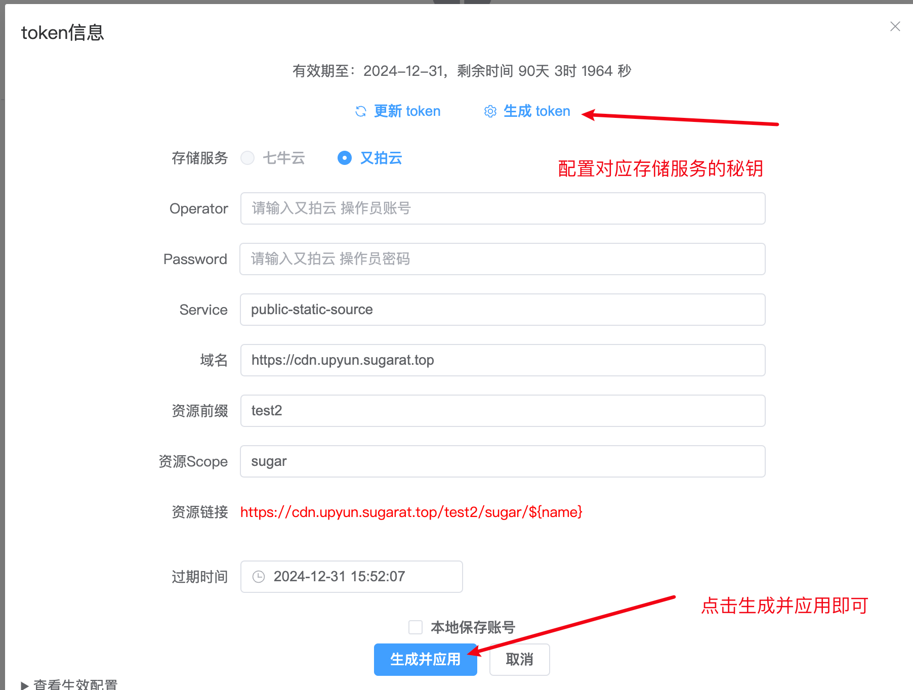

<h1 align="center"> 基于 OSS（对象存储库） 图床 </h1>

<p align="center"></p>

<p align="center">基于对象存储服务搭建的图床应用，<strong>前端纯静态，无需后端</strong></p>

<p align="center">支持 <a target="_blank" href="https://www.qiniu.com/products/kodo">七牛云</a> | <a target="_blank" href="https://www.upyun.com/products/file-storage">又拍云</a></p>

<p align="center">
<a href="https://atqq.github.io/image-bed-qiniu/" target="_blank">GitHub Pages Demo</a> |
<a href="https://imgbed.sugarat.top/" target="_blank">Online Demo</a>
</p>

<p align="center">配置你的 token 即可使用</p>

## 使用
### 运行项目
```sh
# 安装依赖
pnpm install

# 开发预览
pnpm dev

# 构建预览
pnpm build

pnpm preview
```

### Docker启动
```sh
docker run -d -p 8090:80 --restart unless-stopped --name image-bed-app sugarjl/image-bed:latest
```
应用将在 http://localhost:8090 可访问

## 配置token
### 浏览器生成 token
① 点击右上角小钥匙 🔑 图标唤起设置面板



### CLI 生成token
访问 [cli](./../cli/) 目录，修改 `.env` 中的变量
```sh
# 七牛云的 ACCESS_KEY 和 SECRET_KEY
QINIU_ACCESS_KEY=AccessKey
QINIU_SECRET_KEY=SecretKey
# OSS 桶名
QINIU_BUCKET=Bucket

# 绑定的域名，配置时需要带协议,例如 https://abc.example.com
QINIU_DOMAIN=domain
# 资源统一前缀
QINIU_PREFIX=image
# 图片的scope
QINIU_SCOPE=default

# token有效期，默认一个月，单位秒，你可以自行设置
# QINIU_EXPIRES=2592000

# 又拍云相关配置
UPYUN_OPERATOR=operator
UPYUN_PASSWORD=password
UPYUN_BUCKET=service-name
UPYUN_DOMAIN=http://service-name.test.upcdn.net
UPYUN_PREFIX=image
UPYUN_SCOPE=default
# token有效期，默认一个月，单位秒，你可以自行设置（60*60*24*30）
# UPYUN_EXPIRES=2592000
```
最后资源地址为 **`domain/prefix/scope/md5`**

① 七牛云：执行生成 token 脚本
```sh
npm run generate
# 或者
node token.js
```

② 又拍云：执行生成 token 脚本
```sh
npm run generate:upyun
# 或者
node upyun-token.js
```


### 配置项目默认
*执行 `node token.js` 默认会生成这个文件*

在 [packages/client](./../client/) 下创建`.env.local`
```sh
VITE_APP_UPLOAD_TOKEN=你的token
```

启动构建项目即可

### 临时配置
token 将会存在本地（浏览器 LocalStorage）


